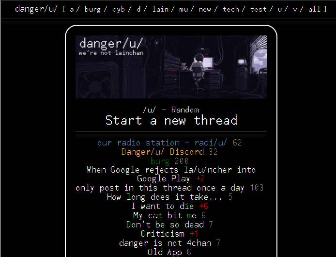
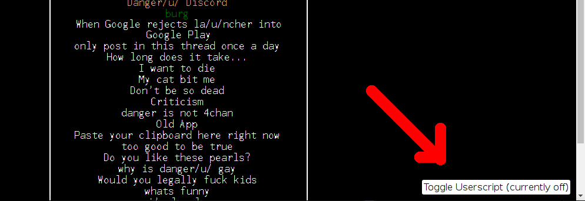

## awoo-catalog

This userscript tracks how many replies you've viewed in a given thread

This was originally a rewrite of [dangeru-catalog](https://github.com/nilesr/dangeru-catalog), which is why it's still a userscript

However, you don't need to install it as a userscript to use it. It's enabled by default in the mobile app, and on the main danger/u/ website you can hover your mouse in the bottom right corner and click to enable it natively (it's a submodule of awoo)

